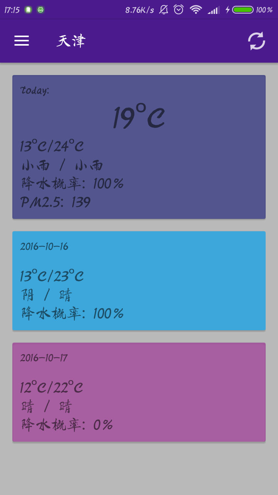
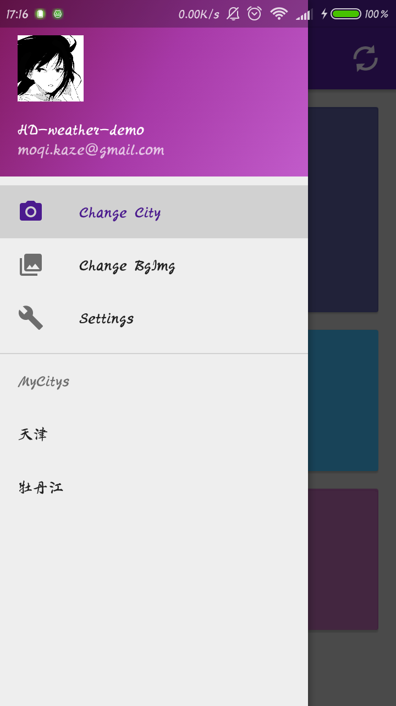
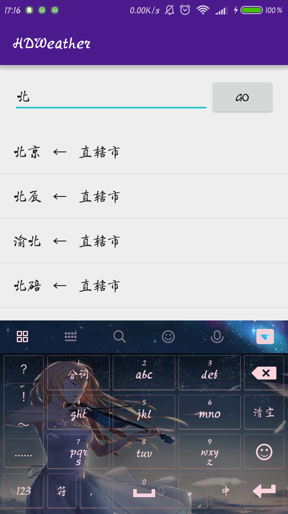

## HDWeather
***
添加：Splash界面    
添加：城市搜索功能    
添加：基于高德地图API的定位显示天气功能    
修复：主页刷新按钮会刷新成天津的问题    

下一个目标：添加侧边栏MyCitys列表，实现快速切换。   
          主页卡片点击查看详细信息。

***
为了整合一下之前学过的内容，每周末进行一些功能的添加和改善。  
目前只是起步阶段。  
已完成：获取天气信息，显示近3日预报，预设城市切换。

下一个目标：做出优雅的城市列表和城市切换。

***
效果展示：   
Splash界面：初次启动获取城市信息写入数据库  

主界面：显示三日天气信息  

侧边栏：用了as预设模板，其他功能待完善

搜索切换城市

